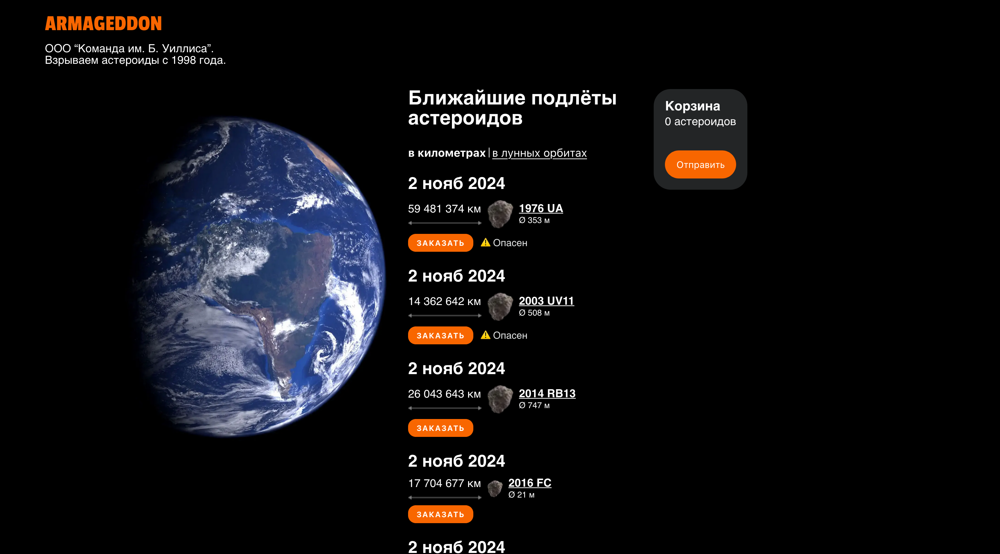

# ARMAGEDDON

?GitHub Actions Tests Status?

Armageddon is an online service for monitoring and ordering the destruction of hazardous asteroids based on data from [NASA's NeoWs API](https://api.nasa.gov/). The application provides detailed information on asteroid flybys near Earth, with infinite scrolling, filtering options, and the ability to place orders for specific asteroids directly to a cart. Each asteroid has a dedicated page with comprehensive flyby details.

## Features

- Main List: Displays a list of asteroid flybys starting from the current date, with infinite scroll.
- Asteroid Information: For each asteroid, displays its name, size, hazard level, closest approach distance, and exact date of maximum proximity.
- Customizable Distance Units: Toggle to view distances in kilometers or lunar distances.
- Cart Functionality: Add specific asteroid flybys to a cart. The cart is visible on the main list page.
- Order Confirmation: After confirming an order, a success page shows all selected flybys.
- Asteroid Detail Page: Includes asteroid-specific information and all flyby events, displaying speed, closest approach time, distance to Earth, and orbital target.

## Local Run

### Clone the repository

```bash

git clone https://github.com/amalumian/ta-armageddon.git
cd ta-armageddon

```

### Install dependencies

```bash

npm install

```

### Add your NASA API key

Create a .env file in the project root and add your API key:

```bash

API_KEY=your_api_key_here

```

### Run the development server

```bash

npm run dev

```

## Tech Stack

- Next.js
- TypeScript
- CSS Modules
- Vite and React Testing Library

## Screenshot


